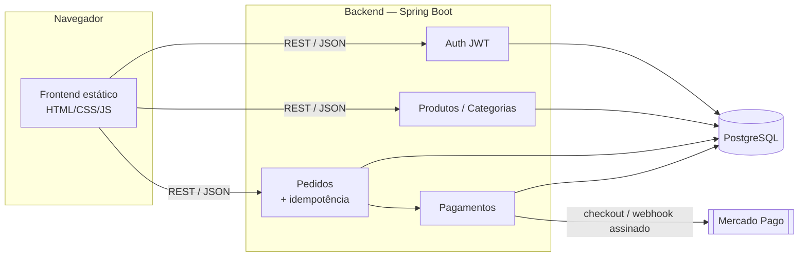
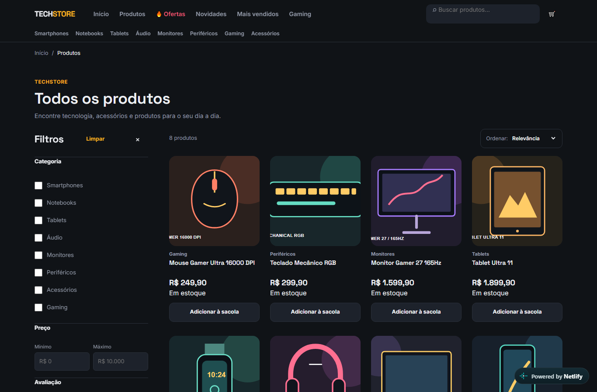
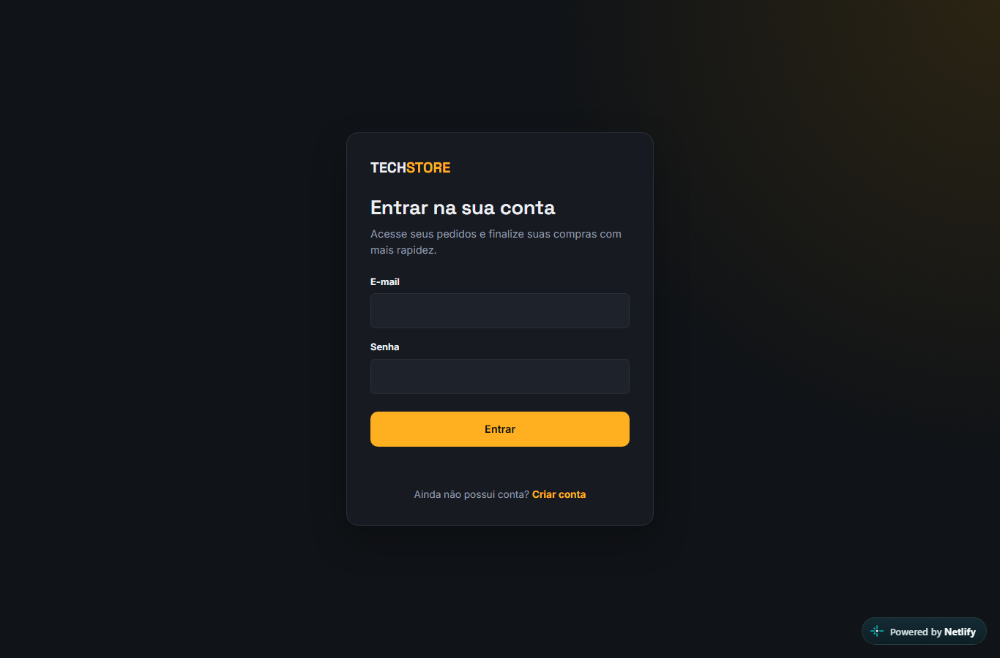

# TechStore — E-commerce Full-Stack

E-commerce completo, mobile-first, com backend real: catálogo, autenticação
JWT, carrinho, checkout com **pagamento via Mercado Pago**, painel
administrativo e banco de dados Postgres versionado por migrations.

> 🔗 **Demo:** https://techstore-demo-anemilton.netlify.app
> 🚀 **API:** https://techstore-api-0vp3.onrender.com
> 📚 **Swagger:** https://techstore-api-0vp3.onrender.com/swagger-ui.html
> 🎥 **Demo animada:** 

---

## Stack

**Frontend** — HTML + CSS + JavaScript (ES Modules), sem build step, sem framework.
**Backend** — Java 17 · Spring Boot 3 · Spring Security (JWT) · Spring Data JPA · PostgreSQL · Flyway · Mercado Pago SDK · springdoc/Swagger.

## Arquitetura



## Funcionalidades

**Loja**
- Catálogo com busca, filtros (categoria, preço, avaliação, estoque), ordenação e paginação
- Abas comerciais (ofertas, novidades, mais vendidos, gaming) reaproveitando a mesma página via querystring
- Página de produto com galeria, variantes, estoque e produtos relacionados
- Cadastro/login com JWT, endereços, histórico de pedidos
- Carrinho persistente e checkout com **Mercado Pago** (Checkout Pro)

**Admin**
- Dashboard, CRUD de produtos e categorias, gestão de status de pedidos

**Backend**
- Autenticação stateless com JWT (BCrypt força 12)
- **Idempotency-Key** no checkout (reenvio não duplica pedido)
- Lock pessimista no estoque (sem overselling em concorrência)
- Webhook do Mercado Pago com **validação de assinatura HMAC-SHA256** e proteção contra replay
- Schema versionado com Flyway (13 migrations)
- Documentação interativa da API via Swagger UI (`/swagger-ui.html`)

## Demo visual

Capturas reais da aplicação deployada (ambiente de **sandbox** do Mercado Pago —
nenhuma cobrança real é processada).

| Vitrine | Produto |
|---|---|
|  |  |
| **Catálogo** | **Login** |
|  |  |

O fluxo de pagamento foi validado de ponta a ponta em sandbox: o checkout cria
uma preferência no Mercado Pago (Checkout Pro), o webhook assinado (HMAC-SHA256)
confirma o pagamento e o pedido transita para **PAGO** com atualização de estoque.

## Estrutura do repositório

```
techstore/
├── frontend/     → loja + admin (estático, sem build)
├── backend/      → API Spring Boot + migrations Flyway
├── LICENSE
└── README.md     → este arquivo
```

Cada pasta tem seu próprio README com detalhes específicos:
[`frontend/README.md`](./frontend/README.md) · [`backend/README.md`](./backend/README.md)

## Como rodar localmente

```bash
# 1. Backend + banco (Docker faz tudo: Postgres + migrations + app)
cd backend
cp .env.example .env        # preencha JWT_SECRET, credenciais do Mercado Pago, etc.
docker compose up --build -d

# 2. Frontend (qualquer servidor estático — precisa ser http://, não file://)
cd ../frontend
python3 -m http.server 5500
```

Acesse `http://localhost:5500`. A API sobe em `http://localhost:8080`
(docs interativas em `http://localhost:8080/swagger-ui.html`).

Para apontar o frontend para uma API hospedada em vez de local, edite uma
única linha em [`frontend/js/config.js`](./frontend/js/config.js) — não há
build step, então nenhum outro arquivo precisa mudar.

## Licença

Distribuído sob a licença MIT — veja [`LICENSE`](./LICENSE).
